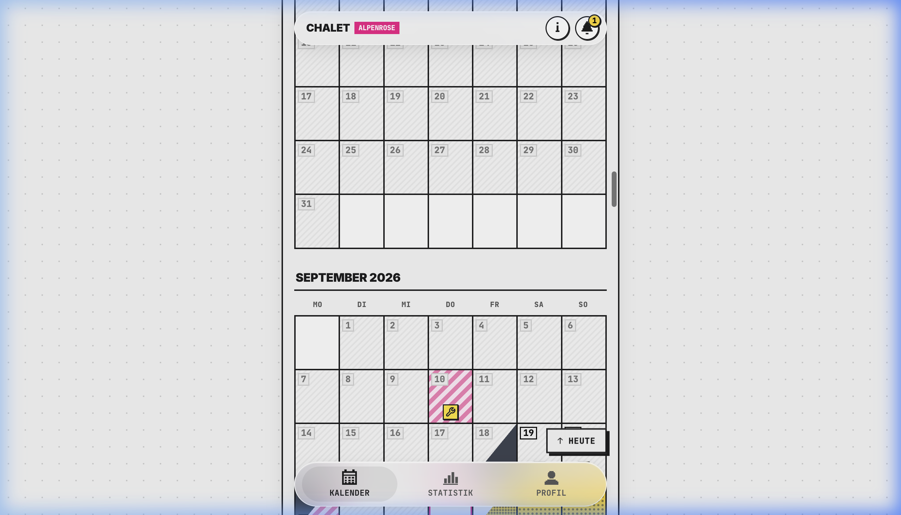
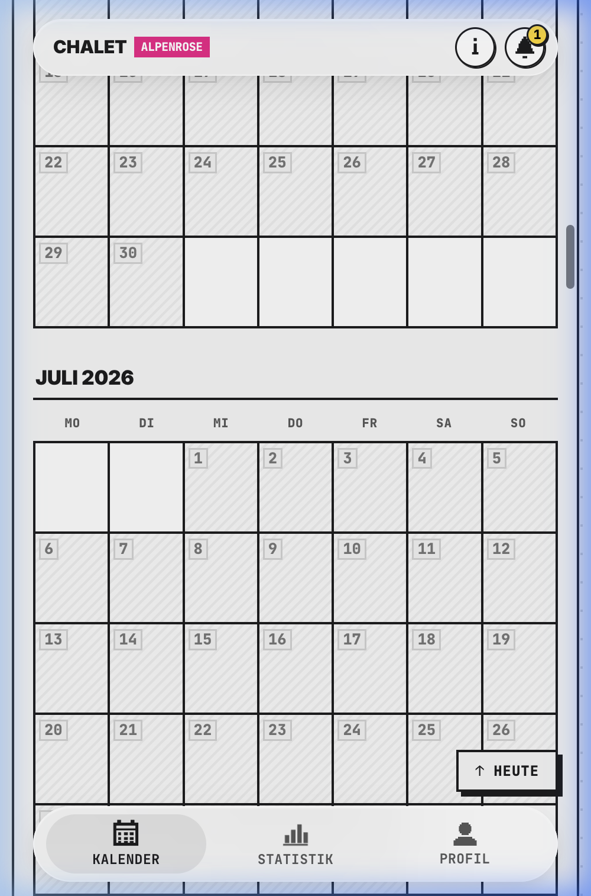
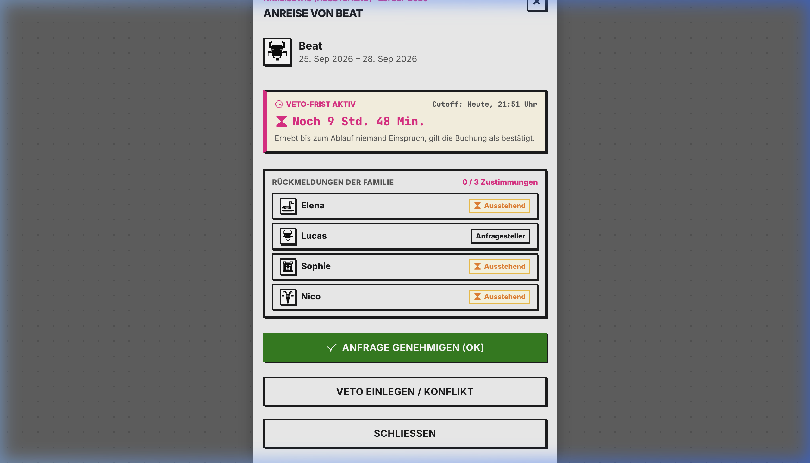
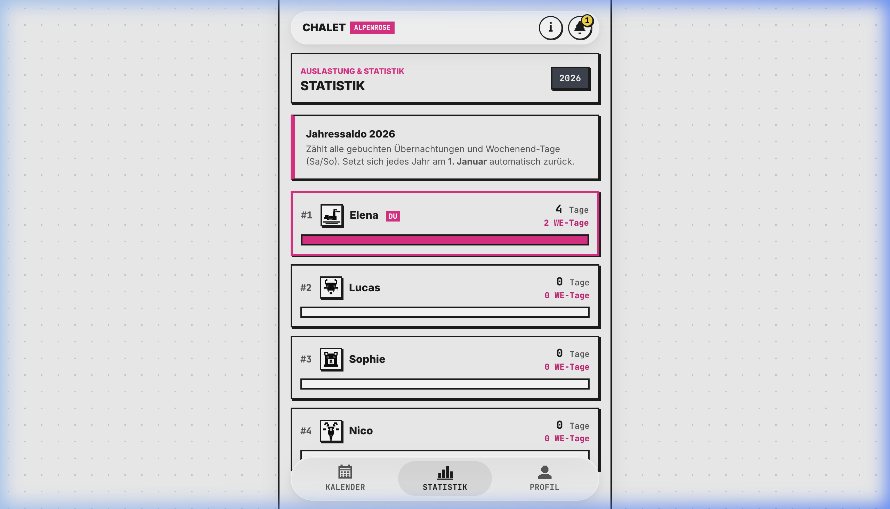
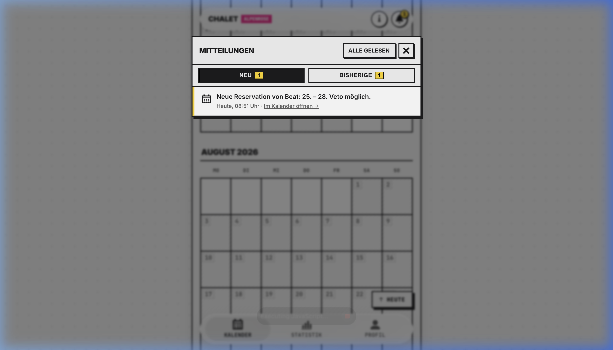
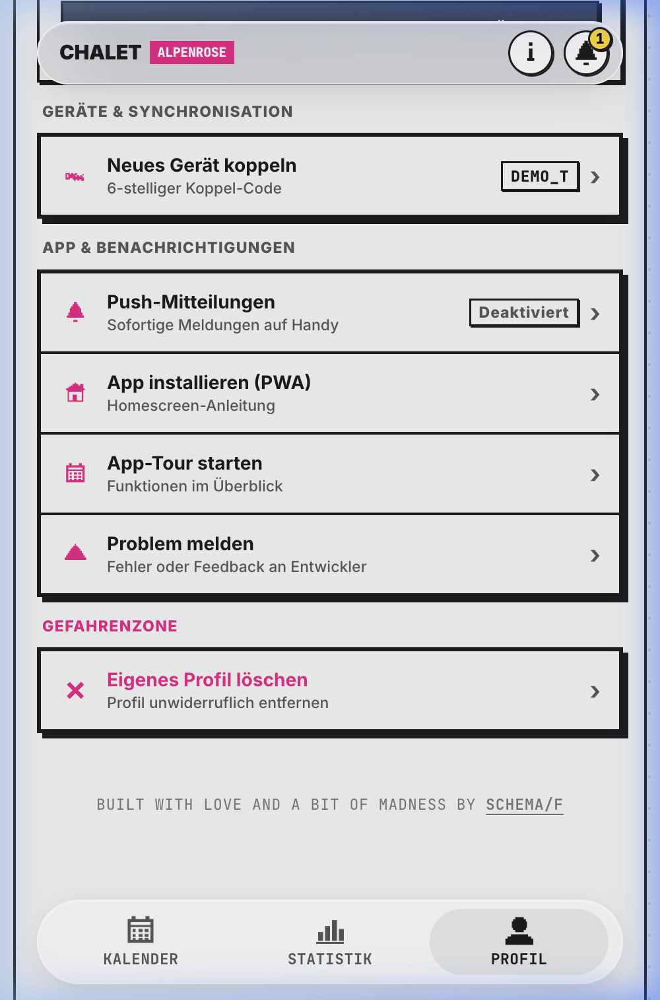

# 🏔️ ChaletWeShare (Demo)

> **Progressive Web App for Shared Alpine Vacation Homes & Multi-Party Co-Ownership**  
> *A high-performance portfolio showcase built with Zero-Framework Vanilla JavaScript, a Bauhaus/Neo-Brutalist design system, offline-first PWA caching, and automated booking conflict resolution.*

[](https://flx-xlf.github.io/ChaletWeShare-Demo/)
[](https://flx-xlf.github.io/ChaletWeShare-Demo/)
[](https://flx-xlf.github.io/ChaletWeShare-Demo/)
[](https://flx-xlf.github.io/ChaletWeShare-Demo/)
[](LICENSE)

---

## 🚀 Interactive Live Demo

Experience the full interactive demo directly in your browser:  
👉 **[https://flx-xlf.github.io/ChaletWeShare-Demo/](https://flx-xlf.github.io/ChaletWeShare-Demo/)**

* **Interactive Client Sandbox**: Pre-seeded with demo profiles (*Elena*, *Lucas*, *Sophie*, *Nico*).
* **Test the Booking Engine**: Book stays, trigger conflict resolutions, view live 48-hour veto timers, and explore fair-share analytics.
* **100% Client-Side**: Runs smoothly on GitHub Pages with zero server dependencies required.

---

## 📸 Visual Showcase

### 1. High-Resolution Bauhaus Calendar & Micro-Chat
*Split-slot check-in/check-out calendar (14:00 check-in / 11:00 check-out), razor-sharp 32x32 SVG pixel-art avatars, and status badges.*



---

### 2. Mobile PWA & Booking Experience
*Optimized for standalone iOS and Android mobile screens. Native bottom sheets, fast tap targets, and zero horizontal jitter.*

| Mobile Calendar View | Booking & Conflict Sheet |
| :---: | :---: |
|  |  |

---

### 3. Fair-Share Analytics & Notification Stream
*Transparent booking quota balances, handover checklists, and real-time sibling notifications.*

| Stats & Quota Analytics | Notification Hub |
| :---: | :---: |
|  |  |

---

### 4. Profile Personalization & 32x32 Bauhaus Pixel-Art Avatars
*Offline sync tokens, device pairing codes, and 13 custom-crafted 32x32 SVG pixel-art Alpine avatars.*

<div align="center">
  
</div>

---

## ✨ Key Architectural Highlights

### ⚡ 1. Zero-Framework Vanilla Architecture
* **Under 95 kB gzipped** total production bundle (JS + CSS).
* **152ms Largest Contentful Paint (LCP)** and **0.00 Cumulative Layout Shift (CLS)**.
* Clean DOM rendering with zero runtime virtual-DOM overhead or heavy framework dependencies.

### 🏔️ 2. Bauhaus & Neo-Brutalist Design Tokens
* **Typography**: Crisp, high-readability modern grotesque paired with monospace metric displays.
* **Color Palette**: Stark Ink (`#0D0D0D`) on Crisp Canvas (`#FFFFFF`), with electric accents (`#F20587` Hot Pink, `#EF4444` Crimson, `#10B981` Emerald).
* **Art Direction**: 13 custom-crafted 32x32 SVG pixel-art Alpine avatars (Swan, Fox, Bear, Marmot, Steinbock, Pine, etc.) rendered with `shape-rendering="crispEdges"`.

### 🛡️ 3. Tiered Conflict Resolution & Veto Deadline Engine
* **Fair-Share Co-Ownership**: Transparent 48-hour objection windows for newly proposed reservations.
* **Smart Overlap Handling**: Distinguishes between same-day check-in/out handovers vs. conflicting multi-day stays.
* **Priority Promotion**: Automated promotion of pending bookings once veto deadlines pass without objection.

### 📱 4. Offline-First PWA Experience
* **Service Worker App Shell**: Custom network-first caching strategy with instant cache fallback for remote Alpine locations with spotty mobile coverage.
* **Standalone Mode**: Configured with Web App Manifest (`maskable` icons, standalone display mode, safe-area inset handling).

### ♿ 5. WCAG 2.1 AA Accessibility
* Verified high color contrast ratios across all status states.
* Screen reader support (`aria-live`, `aria-label`, `<h1 class="sr-only">`).
* Full keyboard navigability with visible focus rings (`:focus-visible`).

### 🔄 6. Self-Healing Multi-Engine Backend
* **Client Demo Mode**: Zero-backend sandbox for instant GitHub Pages preview.
* **Local Development**: Automatic SQLite initialization (`api/chaletweshare.sqlite`).
* **Production**: MariaDB/MySQL with self-healing table auto-creation (`initMysqlSchema()`) preventing HTTP 500 crashes.

---

## 🛠️ Tech Stack

* **Frontend**: Vanilla JavaScript (ES2022), Vanilla CSS (Custom Design System), Vite, anime.js
* **Backend**: PHP 8.x, PDO (MySQL & SQLite), Web Push API (`minishlink/web-push`)
* **DevOps**: GitHub Actions / GitHub Pages, PWA Service Worker

---

## 💻 Local Setup & Development

```bash
# 1. Clone the repository
git clone https://github.com/Flx-xlF/ChaletWeShare-Demo.git
cd ChaletWeShare-Demo

# 2. Install dependencies
npm install

# 3. Start local development server
npm run dev

# 4. Build for production (outputs to /dist)
npm run build
```

---

## 📄 License

This showcase project is licensed under the [MIT License](LICENSE).

---

*Built with love and a bit of madness by [schema/f](https://github.com/Flx-xlF)*
